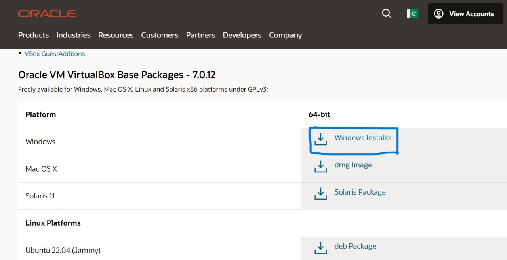
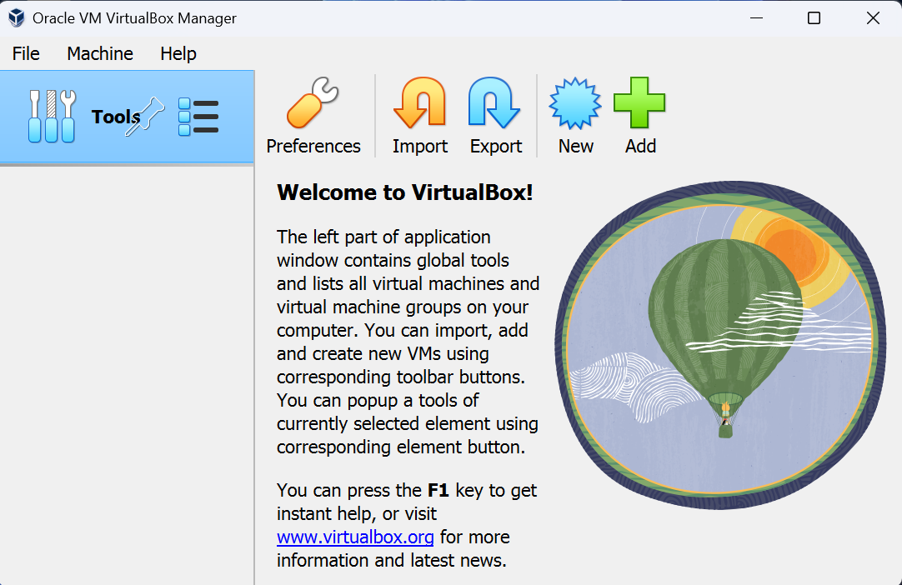
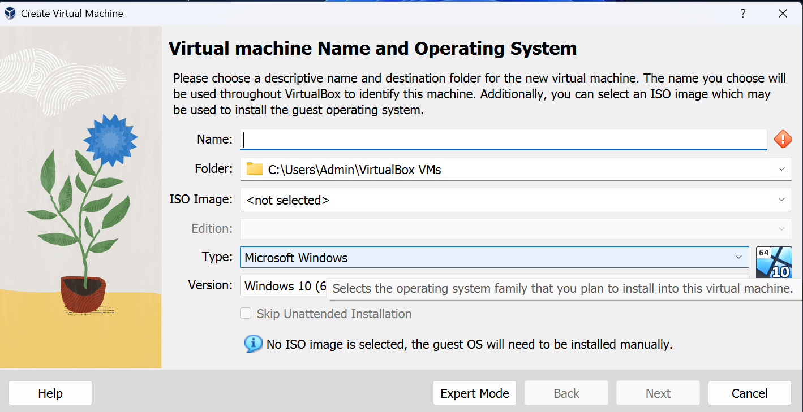
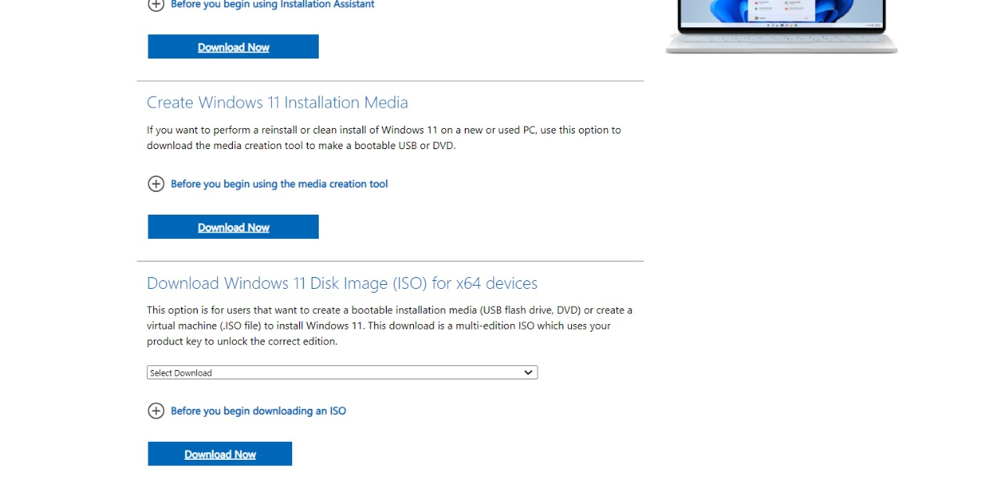
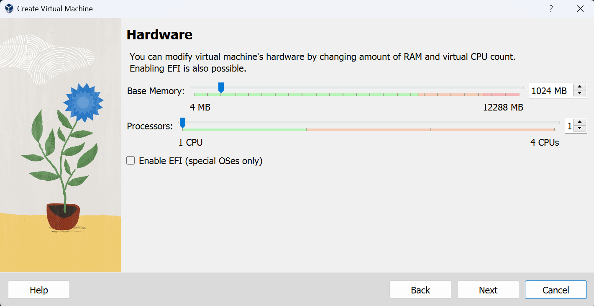
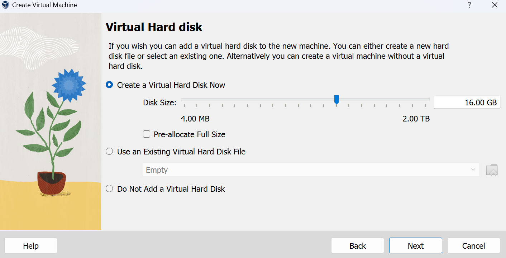
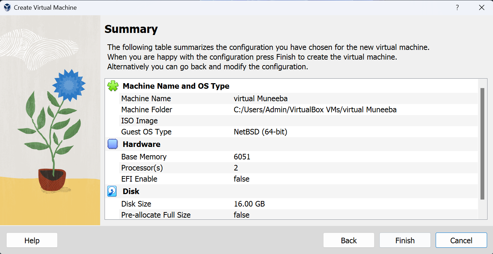
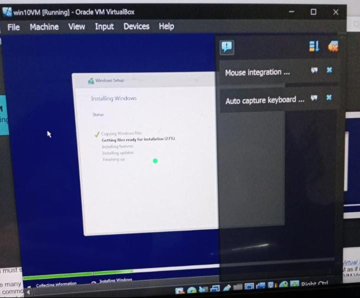
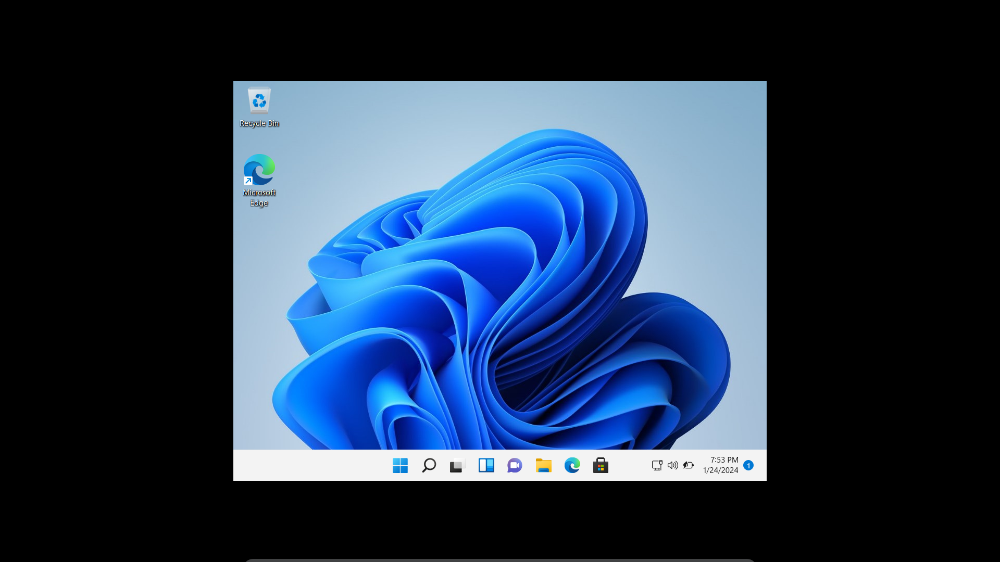

# Install VirtualBox/Windows in Virtual Box

Aim of this is to guide you how to install virtual box and install windows in virtual box.

## Get Virtual Box

-  Go to the "Oracle VirtualBox" download page using the below link.

  https://www.oracle.com/pk/virtualization/technologies/vm/downloads/virtualbox-downloads.html

-  Click on the Windows hosts link. Save the installer file anywhere you prefer.

- Navigate to the installer file and double-click on it.

## Create a new Virtual Machine

- After installation, Click on the .exe file and run it. After this, following window appears:

- Click on "New". Then you will get this kind of interface:

  

- Enter "Name" you want to give to your virtual machine. Give the path of ISO file from you PC in "ISO image".

- If you don't have "windows.iso" file then download it by following these steps bellow.

## Getting ISO File

1. Visit official Microsoft website.
2. Navigate to the download Windows page.
3. Select the version of Windows you want to download.
4. Click on the download button.

- Hurrah! We have ISO file now. Now you can add its path and then click "Next".

## Allocate RAM

Now, you need to decide how much RAM you want to allocate for this VM. For the x86 version, you'll need at least 1GB of RAM. For the x64 version, you'll need 2GB. I have 8GB of RAM in my desktop, so I decided that 3GB was right for my configuration. Whatever you decide, just make sure you stay in the green. If you allocate too much RAM, you'll end up with serious performance issues.

## Creat a Virtual Hard disk

Next, you need to create a virtual drive. Microsoft says that 16GB is the minimum space needed for the 32-bit version, but 20GB is required for the 64-bit version. I decided on a 35GB virtual drive on my desktop, but feel free to make it as large as you need. Just be sure that you have enough space on your actual hard drive to handle the size of your virtual drive. Depending on what you intend to do with the OS, you may want to allocate more or less storage. Applications installed to a VM should be assumed to require the same amount of "real" storage that their standard installations would.

- Click on "Next" button and you will get the following Window:

- Click on "Finish" button. Then Windows start to install in virtual box automatically(because of windows.iso path we give in previous step). Here you can see:

## You're ready to rock

Back at the desktop, you can finally use full-screen mode at the proper resolution. In the VirtualBox menu, go to "View," and select "Switch to Fullscreen." For the most part, this is now the same experience you'd have running it natively. Enjoy yourself, and feel free to poke around all the new features.

Hurrah!!!!!!, We are done.